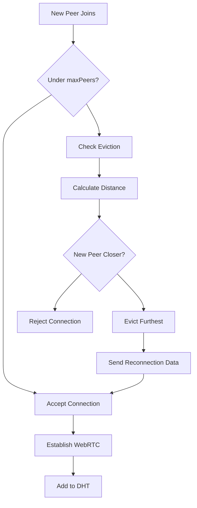
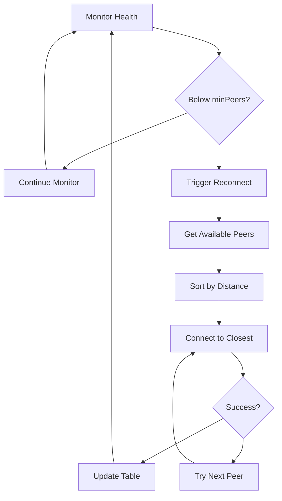
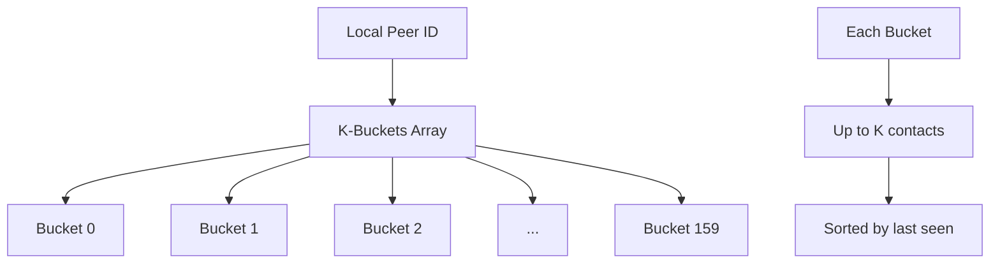
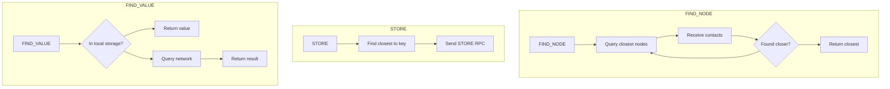
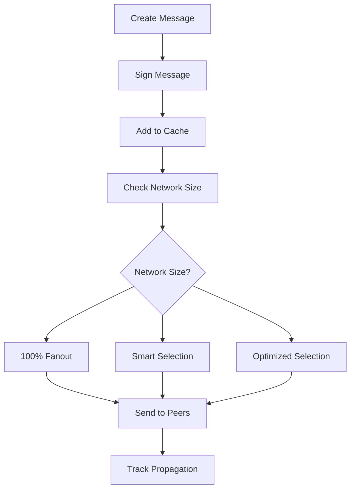
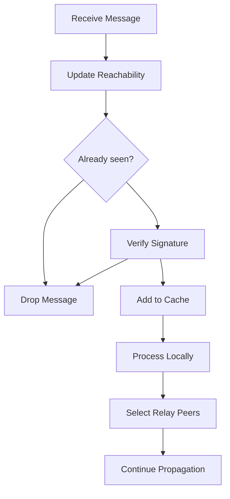
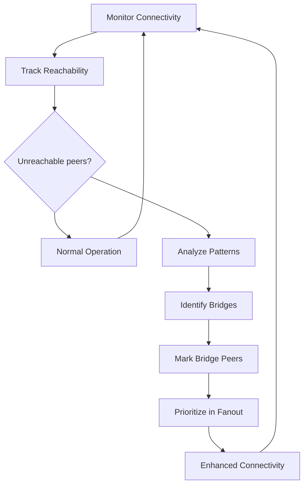
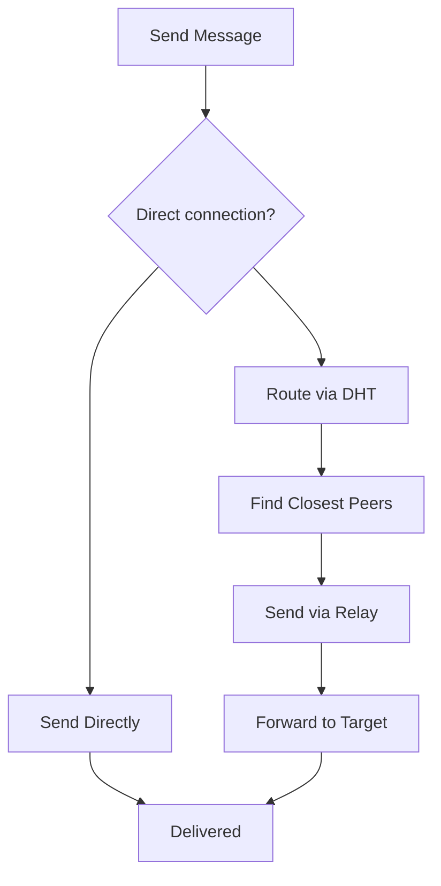

# P2PMesh

> A batteries-included transport-agnostic peer-to-peer WebRTC mesh network library for both browsers and Node.js with reliable message broadcasting via gossip protocol.

This project provides a foundational library for creating peer-to-peer mesh networks using WebRTC (`simple-peer`). It features a platform-agnostic API and a pluggable transport layer for signaling, with an initial WebSocket transport implementation. The network implements a sophisticated gossip protocol for reliable message broadcasting across the partial mesh topology and a Kademlia distributed hash table (DHT) for peer discovery and routing.

## Features

- **Peer-to-Peer Mesh:** Connects peers in a partial mesh using `simple-peer` with WebRTC
- **Reliable Message Broadcasting:** Implements an adaptive gossip protocol with acknowledgments and automatic retries
- **Kademlia DHT:** Uses a distributed hash table for efficient peer discovery and message routing
- **Named Transport System:** Flexible transport registration and configuration system
- **Signaling Optimization:** Intelligent signaling that minimizes server load by routing through the mesh when possible
- **Modular Architecture:** Separated concerns with dedicated managers for connections, events, data handling, and relay operations
- **Island Healing:** Advanced network partitioning detection and healing mechanisms
- **Chord Overlay:** Enhanced network topology for improved message routing
- **Platform Compatible:** Works in both Node.js and browser environments
- **ESM First:** Written as ECMAScript Modules for modern JavaScript environments
- **WebSocket Signaling Server:** Includes a production-ready signaling server with Kademlia-aware bootstrapping
- **Comprehensive Examples:** Demonstrates usage in both browser and Node.js environments with real-time chat applications

## Project Structure

```
p2pmesh/
├── docs/
│   └── named-transports.md         # Documentation for named transport system
├── examples/
│   ├── chat-browser/                # Browser-based chat application example
│   │   ├── app.js
│   │   └── index.html
│   └── chat-node/                   # Node.js chat application example
│       └── app.js
├── src/
│   ├── gossip/                      # Gossip protocol components
│   │   ├── chord-overlay.js         # Chord-like overlay network
│   │   ├── gossip-message.js        # Message structure and validation
│   │   ├── island-healing.js        # Network partition healing
│   │   ├── message-router.js        # Intelligent message routing
│   │   └── peer-reachability.js     # Peer connectivity tracking
│   ├── peer-manager/                # Peer connection management
│   │   ├── connection-manager.js    # WebRTC connection lifecycle
│   │   ├── data-handler.js          # Message processing and routing
│   │   ├── event-manager.js         # Event handling and propagation
│   │   └── relay-manager.js         # Message relay and forwarding
│   ├── servers/
│   │   └── websocket-server.js      # Production WebSocket signaling server
│   ├── transports/
│   │   ├── transport-interface.js   # Abstract transport interface
│   │   ├── transport-registry.js    # Named transport registry system
│   │   └── websocket-transport.js   # WebSocket transport implementation
│   ├── utils/
│   │   ├── peer-id-generator.js     # Secure peer ID generation
│   │   └── simple-peer-loader.js    # Cross-platform SimplePeer loading
│   ├── gossip.js                    # Main gossip protocol orchestrator
│   ├── index.js                     # Main P2PMesh API (createMesh function)
│   ├── kademlia.js                  # Kademlia DHT implementation
│   ├── p2p-mesh.js                  # Core P2PMesh class
│   ├── peer-discovery.js            # Peer discovery and connection strategies
│   ├── peer-manager.js              # Peer connection manager
│   └── signaling-optimizer.js       # Signaling optimization system
├── .gitignore
├── LICENSE
├── package.json
└── README.md
```

## Getting Started

### Prerequisites

- Node.js (v16+ recommended for ESM support)
- npm or yarn

### Installation

Clone the repository and install dependencies:

```bash
git clone <repository-url>
cd p2pmesh
npm install
```

### Running the Examples

1.  **Start the Signaling Server:**

    Open a terminal and run:
    ```bash
    npm run start:server
    ```
    This will start the WebSocket signaling server on `ws://localhost:8080`.

2.  **Run the Browser Chat Example:**

    Open another terminal and run:
    ```bash
    npm run dev:chat
    ```
    This command will serve the `examples/chat-browser/` directory and open `index.html` in your default browser. If it doesn't open automatically, navigate to the URL provided in the console (usually `http://localhost:8081` or similar).

    Open multiple browser tabs or windows to simulate different peers.

3.  **Run the Node.js Chat Example (Optional):**

    Open a new terminal and run:
    ```bash
    node examples/chat-node/app.js
    ```
    You can run multiple instances of this script to simulate multiple Node.js peers. They will connect to the same signaling server and can interact with browser peers.

## Signaling Server

The included WebSocket signaling server provides production-ready features:

### Features

- **Kademlia-aware bootstrapping**: Sends closest peers to new joiners
- **Batched signal handling**: Optimizes signaling traffic
- **Connection management**: Handles peer joins, leaves, and reconnections
- **Error handling**: Robust error handling and recovery

### Running the Server

```bash
npm run start:server
```

The server will start on `ws://localhost:8080` by default.

### Server Configuration

The server can be customized by modifying `src/servers/websocket-server.js`:

```javascript
// Change port
const wss = new WebSocketServer({ port: 9090 });

// Adjust bootstrap peer count
const K_BOOTSTRAP_COUNT = 10;
```

## Troubleshooting

### Common Issues

#### Connection Problems

1. **Peers not connecting**: Check that the signaling server is running and accessible
2. **WebRTC failures**: Verify ICE servers are configured correctly
3. **Firewall issues**: Ensure required ports are open for WebRTC

#### Performance Issues

1. **High CPU usage**: Reduce `maxPeers` or adjust discovery intervals
2. **Memory leaks**: Ensure proper cleanup by calling `mesh.leave()`
3. **Message delivery delays**: Check network topology and gossip configuration

### Debug Mode

Enable debug logging for detailed information:

```bash
# For Node.js examples
DEBUG=1 node examples/chat-node/app.js
```

### Network Diagnostics

```javascript
// Check peer connections
console.log('Connected peers:', mesh.getPeerCount());
console.log('Peer list:', Array.from(mesh.peers.keys()));

// Monitor gossip protocol
mesh.gossipProtocol.on('message:delivered', (messageId) => {
  console.log('Message delivered:', messageId);
});

mesh.gossipProtocol.on('message:failed', (messageId, reason) => {
  console.log('Message failed:', messageId, reason);
});
```

## API Documentation

### Creating a Mesh Network

#### Using Named Transports (Recommended)

```javascript
import { createMesh } from './src/index.js';

const mesh = await createMesh({
  transportName: 'websocket',
  transportOptions: {
    signalingServerUrl: 'ws://localhost:8080'
  },
  maxPeers: 3, // Maximum number of direct peer connections (default: 3)
  iceServers: [{ urls: 'stun:stun.l.google.com:19302' }], // ICE servers for WebRTC
  kademliaK: 20 // Optional - Kademlia K parameter (contacts per bucket)
});

// Join the mesh network
await mesh.join();
```

#### Using Direct Transport Instances (Alternative)

```javascript
import { createMesh } from './src/index.js';
import { WebSocketTransport } from './src/transports/websocket-transport.js';

const transport = new WebSocketTransport('ws://localhost:8080');

const mesh = await createMesh({
  peerId: 'optional-custom-peer-id', // Optional - will be generated if not provided
  transport: transport,
  maxPeers: 3,
  bootstrapNodes: [], // Optional array of bootstrap nodes for the Kademlia DHT
  iceServers: [{ urls: 'stun:stun.l.google.com:19302' }],
  kademliaK: 20
});

await mesh.join();
```

### Events

The mesh instance emits various events that you can listen to:

```javascript
// Connection events
mesh.on('peer:connect', (peerId) => {
  console.log(`Connected to peer: ${peerId}`);
});

mesh.on('peer:disconnect', (peerId) => {
  console.log(`Disconnected from peer: ${peerId}`);
});

mesh.on('peer:timeout', (peerId) => {
  console.log(`Connection to peer ${peerId} timed out`);
});

mesh.on('peer:error', (data) => {
  console.log(`Peer error:`, data);
});

mesh.on('peer:evicted', (data) => {
  console.log(`Evicted from mesh:`, data.reason);
  console.log(`Alternative peers provided:`, data.alternativePeers);
});

// Message receiving
mesh.on('message', ({ from, data }) => {
  console.log(`Message from ${from}:`, data);
});
```

### Sending Messages

```javascript
// Send a direct message to a specific peer
mesh.send(peerId, 'Hello direct message');

// Send structured data
mesh.send(peerId, JSON.stringify({
  type: 'chat',
  message: 'Hello from the mesh!',
  timestamp: Date.now()
}));

// Broadcast a message to all peers (uses gossip protocol)
mesh.sendBroadcast('chat_topic', 'Hello broadcast message');

// Broadcast with custom options
mesh.sendBroadcast('announcements', {
  type: 'system',
  message: 'Network maintenance in 5 minutes'
}, {
  ttl: 30000, // Time to live in milliseconds
  maxHops: 5  // Maximum number of hops
});
```

### Leaving the Mesh

```javascript
// Gracefully leave the mesh network
await mesh.leave();
```

## Architecture Overview

### Core Components

- **P2PMesh**: Main orchestrator class that coordinates all components
- **PeerManager**: Manages WebRTC peer connections and their lifecycle
- **KademliaDHT**: Distributed hash table for peer discovery and routing
- **GossipProtocol**: Reliable message broadcasting with acknowledgments
- **PeerDiscovery**: Intelligent peer discovery and connection strategies
- **SignalingOptimizer**: Reduces signaling server load by routing through mesh

### Modular Peer Management

The peer management system is split into specialized components:

- **ConnectionManager**: Handles WebRTC connection establishment and maintenance
- **DataHandler**: Processes incoming messages and routes them appropriately
- **EventManager**: Manages event propagation and handling
- **RelayManager**: Handles message forwarding and relay operations

### Advanced Gossip Features

- **Island Healing**: Detects and repairs network partitions
- **Chord Overlay**: Provides enhanced network topology for better coverage
- **Message Router**: Intelligent routing based on network topology
- **Peer Reachability**: Tracks peer connectivity and availability

## Advanced Usage

### Custom Transport Implementation

Create your own transport by implementing the transport interface:

```javascript
import { TransportInterface } from './src/transports/transport-interface.js';
import transportRegistry from './src/transports/transport-registry.js';

class MyCustomTransport extends TransportInterface {
  constructor(options) {
    super();
    this.options = options;
  }

  async connect() {
    // Implement connection logic
  }

  async disconnect() {
    // Implement disconnection logic
  }

  send(message) {
    // Implement message sending
  }
}

// Register your transport
transportRegistry.register('my-transport', MyCustomTransport);

// Use it in createMesh
const mesh = await createMesh({
  transportName: 'my-transport',
  transportOptions: {
    // Your custom options
  }
});
```

### Kademlia DHT Configuration

```javascript
const mesh = await createMesh({
  transportName: 'websocket',
  transportOptions: {
    signalingServerUrl: 'ws://localhost:8080'
  },
  kademliaK: 20, // Bucket size (default: 20)
  bootstrapNodes: [
    { id: 'peer1', address: 'ws://bootstrap1.example.com' },
    { id: 'peer2', address: 'ws://bootstrap2.example.com' }
  ]
});
```

### Gossip Protocol Customization

```javascript
// Access gossip protocol for advanced configuration
const gossip = mesh.gossipProtocol;

// Set custom message handlers
gossip.setMessageHandler('custom-topic', (message, fromPeer) => {
  console.log('Received custom message:', message);
});

// Send with custom options
mesh.sendBroadcast('custom-topic', {
  data: 'important announcement'
}, {
  ttl: 60000,     // 1 minute TTL
  maxHops: 10,    // Maximum 10 hops
  priority: 'high' // Message priority
});
```

### Transport System

#### Named Transport Registry

The transport registry allows for flexible transport management:

```javascript
import transportRegistry from './src/transports/transport-registry.js';

// List available transports
console.log('Available transports:', transportRegistry.getNames());

// Register a custom transport
import { MyCustomTransport } from './my-custom-transport.js';
transportRegistry.register('my-transport', MyCustomTransport);

// Create transport instances
const transport = transportRegistry.create('websocket', 'ws://localhost:8080');
```

#### WebSocket Transport

The WebSocketTransport class provides the signaling mechanism for WebRTC connections:

```javascript
import { WebSocketTransport } from './src/transports/websocket-transport.js';

const transport = new WebSocketTransport('ws://localhost:8080');

// Transport events (handled automatically when using named transports)
transport.on('open', () => {
  console.log('Connected to signaling server');
});

transport.on('close', () => {
  console.log('Disconnected from signaling server');
});

transport.on('error', (err) => {
  console.error('Transport error:', err);
});
```

## Mesh Network Architecture

P2PMesh creates a partial mesh network where each peer maintains direct WebRTC connections with a subset of all peers (controlled by `maxPeers`). This approach balances connectivity and scalability:

1. **Connection Establishment:**
   - Peers connect to a central signaling server initially for WebRTC handshake
   - After the handshake, peers establish direct peer-to-peer connections
   - No further communication with the signaling server is needed for data exchange

2. **Peer Management:**
   - Each peer maintains up to `maxPeers` direct connections (default: 5)
   - Uses Kademlia DHT's distance metric to optimize peer selection
   - Implements connection timeout handling and automatic reconnection

3. **Peer Eviction Strategy:**
   - When `maxPeers` is reached, new connections are evaluated using Kademlia distance
   - Furthest peers may be evicted to make room for closer peers
   - This strategy optimizes network topology for efficient message routing

## Signaling Optimization

P2PMesh implements intelligent signaling optimization to minimize load on the signaling server while maintaining connection reliability:

### How It Works

1. **Initial Connection:** New peers use the signaling server for their first connections
2. **Mesh Routing:** Once connected, subsequent signaling attempts to route through existing peer connections
3. **Batching:** Multiple signals to the same peer are batched together to reduce server requests
4. **Fallback:** If mesh routing fails, the system automatically falls back to the signaling server

### Benefits

- **Reduced Server Load:** Up to 70% reduction in signaling server traffic in established networks
- **Improved Scalability:** Networks can grow larger without overwhelming the signaling server
- **Better Reliability:** Multiple signaling paths increase connection success rates
- **Automatic Optimization:** No configuration required - optimization happens automatically

### Flow Example

```
New Peer → Signaling Server → Existing Peer(s) → Signaling over Mesh → Batched Signals → Signaling Server → New Peer
```

This flow ensures that:
- New peers can always connect via the signaling server
- Existing peers use the mesh for efficiency
- Signals are batched when sent back through the server
- The system gracefully handles failures at any step

## Event System

P2PMesh uses an event-driven architecture for handling various network events:

- `peer:connect` - Emitted when a new peer connection is established
- `peer:disconnect` - Emitted when a peer disconnects
- `peer:timeout` - Emitted when a peer connection attempt times out
- `message` - Emitted when a message is received (direct or broadcast)

In addition, the transport layer emits its own events:

- `open` - Transport connection opened
- `close` - Transport connection closed
- `error` - Transport error occurred
- `signal` - Received WebRTC signaling data
- `connect_request` - Connection request from another peer
- `bootstrap_peers` - List of peers for Kademlia bootstrapping
- `kademlia_rpc_message` - Kademlia RPC messages

## Gossip Protocol Architecture

P2PMesh implements a sophisticated gossip protocol for reliable message broadcasting across the partial mesh network. This enables efficient propagation of messages to all peers even when direct connections don't exist between every pair of peers.

### Key Features

#### Adaptive Peer Selection

The gossip protocol dynamically adjusts its fanout ratio based on network size:

- In small networks (≤5 peers): 100% coverage for maximum reliability
- In medium networks (6-15 peers): 80-90% coverage
- In larger networks (>15 peers): 60-70% coverage with optimized selection

This adaptive approach ensures reliable message delivery while preventing network flooding in larger deployments.

#### Reliable Message Delivery

The protocol implements a sophisticated acknowledgment and retry system:

- Messages are tracked until acknowledged by all target peers
- Automatic retries for unacknowledged messages with exponential backoff
- Original message objects are preserved for perfect retransmission
- Configurable retry intervals and maximum retry attempts

#### Message Security and Integrity

- Optional cryptographic message signing using pluggable crypto providers
- Signature verification to ensure message authenticity
- Message deduplication to prevent cycles
- Time-to-live (TTL) limitation via hop counting

#### Topic-Based Subscription

Applications can subscribe to specific message topics with custom handler functions, creating a flexible pub/sub system across the mesh network.

## Network Architecture Diagrams

### 1. Peer Connection Management



### 2. Connection Monitoring



### 3. Kademlia DHT Structure



### 4. DHT Operations



### 5. Gossip Broadcasting



### 6. Gossip Reception



### 7. Island Detection



### 8. Direct Messaging



## Kademlia DHT Implementation

P2PMesh uses a Kademlia Distributed Hash Table (DHT) for efficient peer discovery and message routing:

1. **Peer ID Generation:** 
   - Uses SHA-1 hashing for generating peer IDs compatible with Kademlia
   - Supports custom peer IDs for special network topologies

2. **Routing Table:** 
   - Organizes peers in k-buckets based on XOR distance
   - Provides O(log n) complexity for node lookups
   - Helps with optimizing the peer selection for connections

3. **Bootstrap Process:**
   - Signaling server provides initial peers for bootstrapping
   - Automatically refreshes routing table to maintain network connectivity

## Examples

The project includes comprehensive examples demonstrating various use cases:

### Browser Chat Example

A real-time chat application that runs in the browser:

```bash
npm run dev:chat
```

Features:
- Real-time peer-to-peer messaging
- Visual peer connection status
- Broadcast and direct messaging
- Automatic reconnection handling
- Clean UI with message history

Open multiple browser tabs to see peer-to-peer communication in action.

### Node.js Chat Example

A command-line chat application for Node.js:

```bash
npm run dev:node
```

Features:
- Interactive command-line interface
- Support for both broadcast and direct messaging
- Peer discovery and connection status
- Graceful shutdown handling
- Debug mode support

Run multiple instances to create a mesh network of Node.js peers.

### Example Commands

In the Node.js chat example:

```bash
# Send a broadcast message
/broadcast Hello everyone!

# Send a direct message
/direct <peerId> Hello specific peer!

# List connected peers
/peers

# Show help
/help

# Exit gracefully
/exit
```

### Features Demonstrated

- **Peer Discovery**: Automatic discovery and connection to peers
- **Direct Messaging**: One-to-one communication between specific peers
- **Broadcast Messaging**: Reliable message delivery to all peers using gossip protocol
- **Connection Management**: Graceful handling of peer connections and disconnections
- **Network Resilience**: Automatic healing of network partitions
- **Transport Flexibility**: Using named transports for easy configuration
- **Event Handling**: Comprehensive event system for monitoring network state

## Performance Considerations

### Recommended Settings

- **maxPeers**: 3-5 for most applications (default: 3)
- **kademliaK**: 20 for networks with hundreds of peers
- **Discovery intervals**: Default settings work well for most use cases

### Scaling Guidelines

- **Small networks (< 10 peers)**: Default settings work well
- **Medium networks (10-100 peers)**: Consider increasing `kademliaK` to 30-40
- **Large networks (> 100 peers)**: Use bootstrap nodes and adjust discovery intervals

### Memory Usage

- Each peer connection uses approximately 1-2MB of memory
- Gossip protocol maintains message cache (configurable TTL)
- Kademlia routing table scales logarithmically with network size

## Future Enhancements

- Further Kademlia DHT optimization for peer discovery and data lookup
- Additional transport layer implementations (WebRTC Data Channel, HTTP/WebSockets)  
- Distributed data storage capabilities on top of Kademlia DHT
- End-to-end encryption options for message payloads
- Connection quality metrics and routing optimization
- Comprehensive test suite
- UMD/CDN builds for browser usage without bundlers

## Contributing

Contributions are welcome! Please feel free to submit a Pull Request.

### Development Setup

```bash
git clone <repository-url>
cd p2pmesh
npm install

# Run the signaling server
npm run start:server

# In another terminal, run examples
npm run dev:chat
# or
npm run dev:node
```

### Code Style

- Use ESM modules
- Follow existing naming conventions
- Add JSDoc comments for public APIs
- Include error handling

## License

This project is licensed under the MIT License - see the [LICENSE](LICENSE) file for details.
